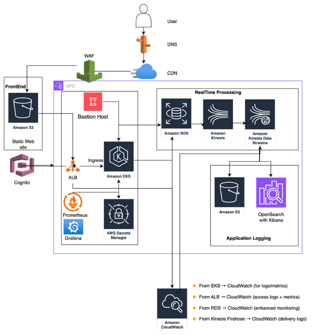

# AWS Multi-Tier Application with Terraform

## 📖 Overview

This project provisions a complete multi-tier application architecture on AWS using Terraform. It includes networking, compute, storage, security, monitoring, and authentication components. The infrastructure is modularized for reusability and scalability, supporting environments like `dev`, `staging`, and `prod`.

---

## 🗺️ Architecture Diagram



The architecture includes:

- **Frontend**: S3 static site with CloudFront and Route53
- **Backend**: EKS cluster with RESTful APIs
- **Database**: RDS PostgreSQL with standby and read replica
- **Authentication**: Cognito for user auth and ALB integration
- **Security**: IAM roles, WAF, Secrets Manager
- **Monitoring**: CloudWatch, Kinesis, OpenSearch
- **Networking**: VPC with public/private subnets, NAT, IGW
- **Access**: Bastion host (Jumpbox)

## ⚙️ Setup Instructions

1. **Clone the repository**
   ```bash
   git clone https://github.com/agileqatester/ntier-app.git
   cd ntier-app
   ```
2. **Install prerequisites**

 - Terraform
 - AWS CLI with configured credentials
 - kubectl (for EKS access)
   
3. **Initialize Terraform**
   ```
    cd env/dev
    terraform init
    ```
4. **Plan and apply**
   ```
    terraform plan
    terraform apply

    ```
5. **Access resources**   
 - EKS: ```aws eks update-kubeconfig --name <cluster-name> ```. ```<cluster-name> ``` need to be defined in terraform.tfvars
 - Frontend: CloudFront URL from outputs
 - RDS: Connect using credentials from Secrets Manager

---

### 🧱 Terraform Modules

| Module           | Purpose                                                                 |
|------------------|-------------------------------------------------------------------------|
| `vpc`            | Core networking: subnets, NAT, IGW                                      |
| `alb`            | Public-facing Application Load Balancer (HTTPS)                         |
| `eks`            | EKS Cluster + Node Groups + IRSA                                        |
| `rds`            | PostgreSQL DB (Primary + Read Replica + Standby)                        |
| `jumpbox`        | Bastion host with tooling                                               |
| `secret_manager` | Securely stores RDS credentials                                         |
| `frontend`       | S3 static site + CloudFront + Route53 + Cognito                         |
| `logging`        | Kinesis → S3/OpenSearch + Firehose + CloudWatch logs                    |
| `cognito`        | User auth + ALB integration                                             |
| `waf`            | Web ACL for ALB or CloudFront (e.g. rate limiting, SQLi rules)          |
| `monitoring`     | CloudWatch metrics, alarms (CPU, memory, request count)                 |
| `security`       | IAM policies, roles, group permissions, boundary enforcement            |


## 📡 API Reference

### Web Front End
- **Hosted on**: Amazon S3 + CloudFront
- **Features**: Static site delivery, HTTPS via ACM, DNS via Route53
- **Authentication**: Integrated with Amazon Cognito

### RESTful API Backend
- **Hosted on**: Amazon EKS
- **Routing**: Managed by ALB with path-based routing
- **Security**: IAM roles for service accounts (IRSA), WAF protection

### Database
- **Service**: Amazon RDS (PostgreSQL)
- **Features**: Multi-AZ standby, read replica
- **Access**: Credentials stored in AWS Secrets Manager

### Authentication Service
- **Service**: Amazon Cognito
- **Features**: User pools, ALB authentication, token-based access

### Real-time Data Processing
- **Services**: Amazon Kinesis Data Streams + Firehose
- **Storage**: Logs and metrics sent to S3 and OpenSearch
- **Monitoring**: CloudWatch dashboards and alarms

## 💡 Enhancement Ideas

- **CI/CD Integration**: Add Jenkins Job, GitHub Actions or CodePipeline for automated deployments
- **Blue/Green Deployments**: Use ALB target groups for zero-downtime updates
- **Cost Optimization**: Add auto-scaling policies and spot instance support
- **Secrets Rotation**: Automate RDS credential rotation with Lambda
- **Multi-Region Support**: Extend architecture for high availability across regions
- **Service Mesh**: Integrate AWS App Mesh for microservices observability
- **API Gateway**: Add API Gateway for external API management and throttling
