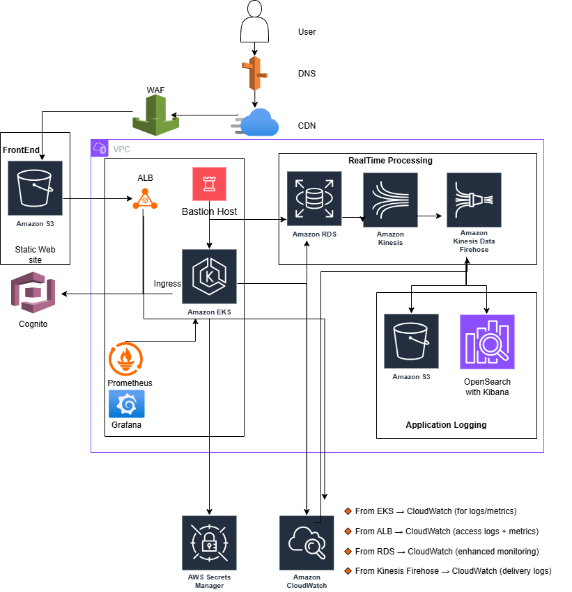

# AWS Multi-Tier Application with Terraform

## 📖 Overview

This project provisions a complete multi-tier application architecture on AWS using Terraform. It includes networking, compute, storage, security, monitoring, and authentication components. The infrastructure is modularized for reusability and scalability, supporting environments like `dev`, `staging`, and `prod`.

---

## 🗺️ Architecture Diagram




The architecture includes:

- **Frontend**: S3 static site with CloudFront and Route53
- **Authentication**: Cognito for user auth and ALB integration
- **Backend**: EKS cluster with RESTful APIs
- **Database**: RDS PostgreSQL with standby and read replica
- **Security**: IAM roles, WAF, Secrets Manager
- **Monitoring**: CloudWatch, Kinesis, OpenSearch
- **Networking**: VPC with public/private subnets, NAT, IGW
- **Access**: Bastion host (Jumpbox)

## ⚙️ Setup Instructions

1. **Clone the repository**
   ```bash
   git clone https://github.com/agileqatester/ntier-app.git
   cd ntier-app
   ```
2. **Install prerequisites**

 - Terraform
 - AWS CLI with configured credentials
 - kubectl (for EKS access)
   
3. **Initialize Terraform**
   You can run Terraform directly from an env folder or use the provided Makefile which defaults to `env/dev/terraform.tfvars`.

   - Initialize from the dev environment:
     ```bash
     cd env/dev
     terraform init
     ```

   - Or from the repo root using the Makefile (recommended for convenience):
     ```bash
     make init   # runs terraform init under the selected env (defaults to env/dev)
     ```
4. **Plan and apply**
   Using the Makefile (defaults to env/dev/terraform.tfvars):
   ```bash
   make plan    # prompts and runs: terraform plan -var-file=${VARFILE}
   make apply   # prompts and runs: terraform apply -var-file=${VARFILE}
   make destroy # prompts and runs: terraform destroy -var-file=${VARFILE}
   ```

   Or run Terraform directly from an env folder:
   ```bash
   cd env/dev
   terraform plan -var-file=terraform.tfvars
   terraform apply -var-file=terraform.tfvars
   ```
5. **Access resources**   
 - EKS: ```aws eks update-kubeconfig --name <cluster-name> ```. ```<cluster-name> ``` need to be defined in terraform.tfvars
 - Frontend: CloudFront URL from outputs
 - RDS: Connect using credentials from Secrets Manager

Notes about environments and NAT behavior
----------------------------------------

- This repository contains example environment variable files under `env/`.
   - `env/dev/terraform.tfvars` is configured for development and, by default, uses a single NAT *instance* (cheaper, suitable for non-production).
   - `env/prod/terraform.tfvars` is configured for production and uses NAT *gateways* (high-availability, higher cost).

- The VPC behavior is controlled by the `nat_mode` variable which accepts `gateway` or `instance`. If you want to change the behavior for an environment, edit the environment tfvars and set:
   ```hcl
   nat_mode = "gateway"   # or "instance"
   ```

Optional endpoint subnets (short)
- Provide `endpoint_subnet_cidrs` (one CIDR per AZ) in your env tfvars to create dedicated endpoint subnets.
- The endpoint Security Group is owned by `modules/security` and is exported as `module.security.endpoint_security_group_id`; `module.vpc` will use it automatically.

AWS credentials and common troubleshooting
-----------------------------------------

- Terraform (the AWS provider) looks for credentials in this order: environment variables, `~/.aws/credentials` (profile), SSO/session, and EC2 instance metadata. If you see "No valid credential sources found", ensure one of the following is configured:
   - Export credentials in your shell:
      ```bash
      export AWS_ACCESS_KEY_ID=... 
      export AWS_SECRET_ACCESS_KEY=...
      export AWS_SESSION_TOKEN=...   # if using temporary creds
      ```
   - Use a named profile and export `AWS_PROFILE` or set `profile` in `provider.tf`.
   - If you're not on EC2, you can disable IMDS probing to avoid metadata errors:
      ```bash
      export AWS_EC2_METADATA_DISABLED=true
      ```

- If `terraform init` fails trying to download providers, check network/proxy settings or run the init behind a network that allows access to `registry.terraform.io`.

Debugging tips
--------------

- If Terraform prompts for variables during `plan` or `apply`, either supply them via `-var-file` (recommended) or add defaults to the root `variables.tf` for non-sensitive defaults.
- To ensure the jumpbox->RDS security-group rule is created automatically, set the root variable `allow_jumpbox_to_rds = true` in your environment tfvars (default is `false`). This prevents Terraform plan-time errors related to unknown cross-module values.


---

## 🧪 Quick Testing Setup

For a minimal testing environment (no RDS, logging, monitoring, WAF, or frontend):

1. **Update test configuration:**
   ```bash
   # Edit env/dev/test.tfvars and set:
   # - my_ip (get with: curl -s ifconfig.me)
   # - public_key_path (e.g., /Users/you/.ssh/id_rsa.pub)
   ```

2. **Deploy test environment:**
   ```bash
   make test-plan    # Review what will be created
   make test-apply   # Deploy (takes ~10-15 minutes)
   ```

3. **Get connection info:**
   ```bash
   ./scripts/show-info.sh
   # Or manually:
   terraform output
   ```

4. **Test the application:**
   ```bash
   # SSH to jumpbox
   ssh -i ~/.ssh/id_rsa ec2-user@<jumpbox_ip>
   
   # From jumpbox, configure kubectl and test
   aws eks update-kubeconfig --name ntier-eks-cluster --region us-east-1
   kubectl get pods
   kubectl get svc
   
   # Get test app URL and test it
   SERVICE_URL=$(kubectl get svc ntire-app-test-svc -o jsonpath='{.status.loadBalancer.ingress[0].hostname}')
   curl http://$SERVICE_URL
   ```

5. **Cleanup:**
   ```bash
   make test-destroy
   ```

**Test environment includes:** VPC, EKS, Jumpbox, ALB, Test App (Flask), Security Groups, NAT instance  
**Estimated cost:** ~$0.15-0.20/hour (~$3.50-5/day)

📖 See [QUICKSTART.md](QUICKSTART.md) for more details and [TESTING.md](TESTING.md) for comprehensive testing guide.

---

### 🧱 Terraform Modules

| Module           | Purpose                                                                 |
|------------------|-------------------------------------------------------------------------|
| `vpc`            | Core networking: subnets, NAT, IGW                                      |
| `alb`            | Public-facing Application Load Balancer (HTTPS)                         |
| `eks`            | EKS Cluster + Node Groups + IRSA                                        |
| `rds`            | PostgreSQL DB (Primary + Read Replica + Standby)                        |
| `jumpbox`        | Bastion host with tooling                                               |
| `secrets_manager` | Securely stores RDS credentials                                         |
| `frontend`       | S3 static site + CloudFront + Route53 + Cognito                         |
| `logging`        | Kinesis → Firehose → S3/OpenSearch + CloudWatch logs                    |
| `cognito`        | User auth + ALB integration                                             |
| `waf`            | Web ACL for ALB or CloudFront (e.g. rate limiting, SQLi rules)          |
| `monitoring`     | CloudWatch metrics, alarms (CPU, memory, request count)                 |
| `security`       | IAM policies, roles, group permissions, boundary enforcement            |
| `test-app`       | Simple Flask test application for EKS validation                        |

Terraform parameters are defined in variables.tf files under each module. There is also example of terraform.tfvars in env/dev

## 📡 API Reference

### Web Front End
- **Hosted on**: Amazon S3 + CloudFront
- **Features**: Static site delivery, HTTPS via ACM, DNS via Route53
- **Authentication**: Integrated with Amazon Cognito

### Authentication Service
- **Service**: Amazon Cognito
- **Features**: User pools, ALB authentication, token-based access

### RESTful API Backend
- **Hosted on**: Amazon EKS
- **Routing**: Managed by ALB with path-based routing
- **Security**: IAM roles for service accounts (IRSA), WAF protection

### Database
- **Service**: Amazon RDS (PostgreSQL)
- **Features**: Multi-AZ standby, read replica
- **Access**: Credentials stored in AWS Secrets Manager

### Real-time Data Processing
- **Services**: Amazon Kinesis Data Streams + Firehose
- **Storage**: Logs and metrics sent to S3 and OpenSearch (can be reviwed in Kabana)

### Monitoring
- **Monitoring**: CloudWatch dashboards and alarms
- **EKS**: Promethus with Grafana

## 💡 Enhancement Ideas

- **CI/CD Integration**: Add Jenkins Job, GitHub Actions or CodePipeline for automated deployments
- **Blue/Green Deployments**: Use ALB target groups for zero-downtime updates
- **Cost Optimization**: Add auto-scaling policies. Already have spots and Gravitron instances
- **Secrets Rotation**: Automate RDS credential rotation with Lambda
- **Multi-Region Support**: Extend architecture for high availability across regions
- **Service Mesh**: Integrate AWS App Mesh for microservices observability
- **API Gateway**: Add API Gateway for external API management and throttling
